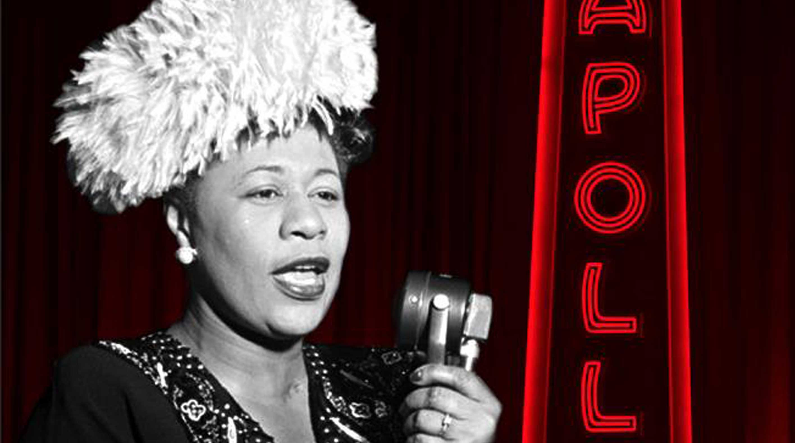

---
up:: [Writing MOC](Writing%20MOC)
tags::  #writing #randomMemory #person #artist 
dates:: 1917-1996 

# Ella Fitzgerald

### What was the most memorable thing about this person?
I became a fan of Ella when I was in my 20's and living in a huge classic 6 apt on Eastern Parkway in Brooklyn.  The routine was I would have a few tokes and do the dinner dishes with Ella playing on the radio in the kitchen.  It was a relaxing routine and provided a nice respite from the stressors of living in the city.  The stressors were pretty harsh living with roommates slowly dying of AIDS in a huge and beautiful and usually empty apartment and being keenly aware of how crowded NYC was and just how close ghettos and suffering families.  

Her voice was so soothing and timeless.  Her work with Louis Armstrong will always be part of the soundtrack to life in the City for me.

### Was there something I didn't agree with here?
What's not to agree with. The lady was from Mount Vernon after all.

### What questions would I ask this person ?
Did you really know just how many people you kept sane with your voice.  Just how much joy did you know you'd be bringing to people often in their darkest hours.

### What am I now interested in because of this person?
Jazz and music from the 50's

> Ella Jane Fitzgerald (April 25, 1917 – June 15, 1996) was an American jazz singer, sometimes referred to as the "First Lady of Song", "Queen of Jazz", and "Lady Ella". She was noted for her purity of tone, impeccable diction, phrasing, timing, intonation, and a "horn-like" improvisational ability, particularly in her scat singing.
>
> After a tumultuous adolescence, Fitzgerald found stability in musical success with the Chick Webb Orchestra, performing across the country but most often associated with the Savoy Ballroom in Harlem. Her rendition of the nursery rhyme "A-Tisket, A-Tasket" helped boost both her and Webb to national fame. After taking over the band when Webb died, Fitzgerald left it behind in 1942 to start her solo career. Her manager was Moe Gale, co-founder of the Savoy, until she turned the rest of her career over to Norman Granz, who founded Verve Records to produce new records by Fitzgerald. With Verve she recorded some of her more widely noted works, particularly her interpretations of the Great American Songbook.
>
> While Fitzgerald appeared in movies and as a guest on popular television shows in the second half of the twentieth century, her musical collaborations with Louis Armstrong, Duke Ellington, and The Ink Spots were some of her most notable acts outside of her solo career. These partnerships produced some of her best-known songs such as "Dream a Little Dream of Me", "Cheek to Cheek", "Into Each Life Some Rain Must Fall", and "It Don't Mean a Thing (If It Ain't Got That Swing)". In 1993, after a career of nearly 60 years, she gave her last public performance. Three years later, she died at the age of 79 after years of declining health. Her accolades included 14 Grammy Awards, the National Medal of Arts, the NAACP's inaugural President's Award, and the Presidential Medal of Freedom.
>
> [Wikipedia](https://en.wikipedia.org/wiki/Ella%20Fitzgerald)
