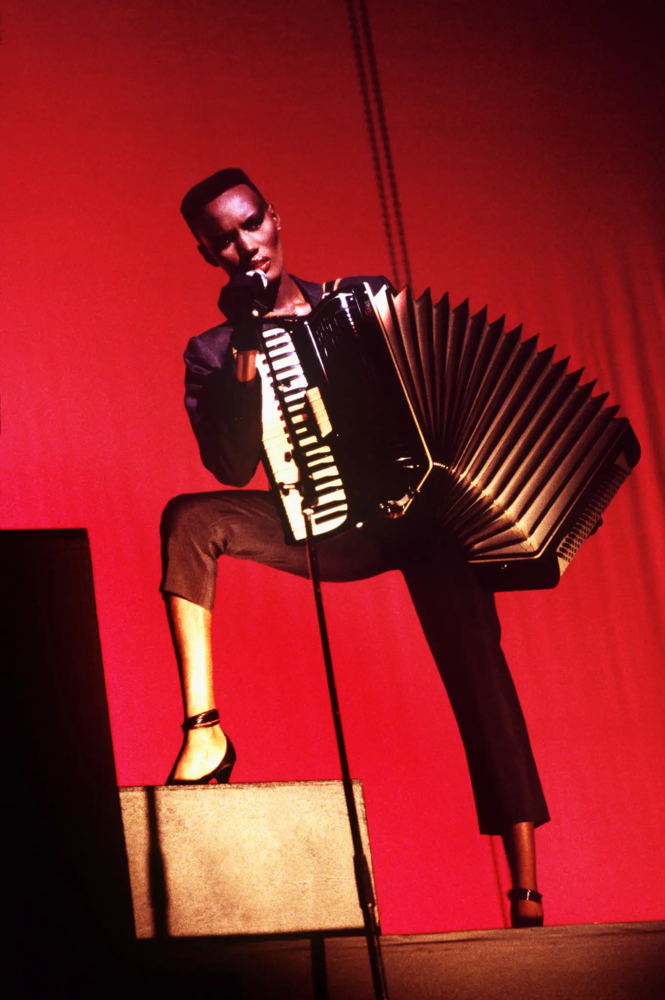

tags:: #people #artist 
dates:: 1948 - 

# Grace Jones

- She reminds me of [Lee Scratch Perry](Lee%20Scratch%20Perry) because like him, she is willing to seem crazy or eccentric in the pursuit of her art.  Less about pleasing anyone and more about realizing the vision that she is compelled to bring to life.  
- She's also similar because she defies expectation.  A little girl from a challenging home life in Jamaica who moves to Buffalo, takes acid, moves to Paris, becomes a model and toast of the town only to lean into art by becoming a living conceptual art piece in her production of  [A One Man Show](A%20One%20Man%20Show) created in partnership with husband [Jean Paul Goude](Jean%20Paul%20Goude.md).
- She's different because unlike most people, she does not seek to moderate her voice and presentation to make people comfortable.  Rather she is unafraid of confrontation.  You will see her and you will deal with her as she is. The opposite of a shrinking violet or geisha.
- She's important because she defies so many limits and constraints through sheer will power.  Her work with [Issey Miyake](Issey%20Miyake.md) is a perfect example.  A woman from Jamaica who becomes close to a Japanese designer and absorbs and transforms the fruits of that friendship into inputs for her own art.  That is pure creativity and magic.

> Grace Beverly Jones  (born 19 May 1948) is a model, singer and actress. Born in Jamaica, she and her family moved to Syracuse, New York, when she was a teenager. Jones began her modelling career in New York state, then in Paris, working for fashion houses such as Yves St. Laurent and Kenzo, and appearing on the covers of Elle and Vogue. She notably worked with photographers such as Jean-Paul Goude, Helmut Newton, Guy Bourdin, and Hans Feurer, and became known for her distinctive androgynous appearance and bold features.
>
> Beginning in 1977, Jones embarked on a music career, securing a record deal with Island Records and initially becoming a high-profile figure of New York City's Studio 54-centered disco scene. In the early 1980s, she moved toward a new wave style that drew on reggae, funk, post-punk, and pop music, frequently collaborating with both the graphic designer Jean-Paul Goude and the musical duo Sly & Robbie. She scored Top 40 entries on the UK Singles Chart with "Private Life", "Pull Up to the Bumper", "I've Seen That Face Before", and "Slave to the Rhythm". In 1982, she released the music video collection A One Man Show, directed by Goude, which earned her a nomination for Best Video Album at the 26th Annual Grammy Awards. Her most popular albums include Warm Leatherette (1980), Nightclubbing (1981), and Slave to the Rhythm (1985).
>
> As an actress, Jones appeared in several indie films prior to landing her first mainstream appearance as Zula in the fantasy-action film Conan the Destroyer (1984) alongside Arnold Schwarzenegger and Sarah Douglas, and subsequently appeared in the James Bond movie A View to a Kill (1985) as May Day, and starred as a vampire in Vamp (1986); all of which earned her nominations for the Saturn Award for Best Supporting Actress. In 1992, Jones acted in  the Eddie Murphy film Boomerang, and contributed to the soundtrack. She also appeared alongside Tim Curry in the 2001 film Wolf Girl.
>
> Jones was ranked 82nd on VH1's 100 Greatest Women of Rock and Roll (1999). In 2008, she was honored with a Q Idol Award. Jones influenced the cross-dressing movement of the 1980s and has been cited as an inspiration for multiple artists, including Annie Lennox, Lady Gaga, Rihanna, Solange, Lorde, Róisín Murphy, Brazilian Girls, Nile Rodgers, Santigold, and Basement Jaxx. In 2016, Billboard ranked her as the 40th greatest dance club artist of all time.
>
> [Wikipedia](https://en.wikipedia.org/wiki/Grace%20Jones)